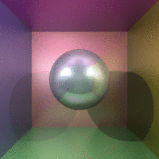

# davah-raytracer

A simple raytracer. Features:

- Adjustable camera position and direction
- Spheres, planes, and triangles
- Point lights
- Lighting with the Phong reflection model
- Customizable materials (ka, kd, ks in the Phong model, etc.)
- Optional antialiasing and fuzzy reflections
- ... and a gif to make you dizzy:

Todo:
- Directional lights
- Loading textures
- Fog so the horizon stops looking so ugly?
- Refraction?
